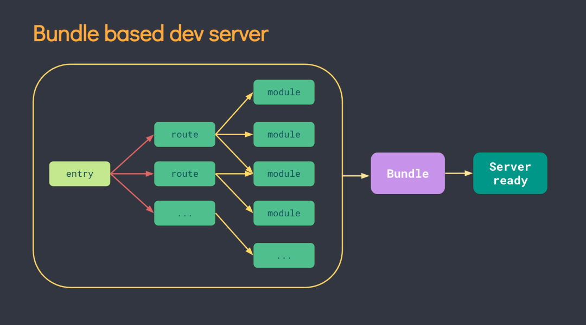
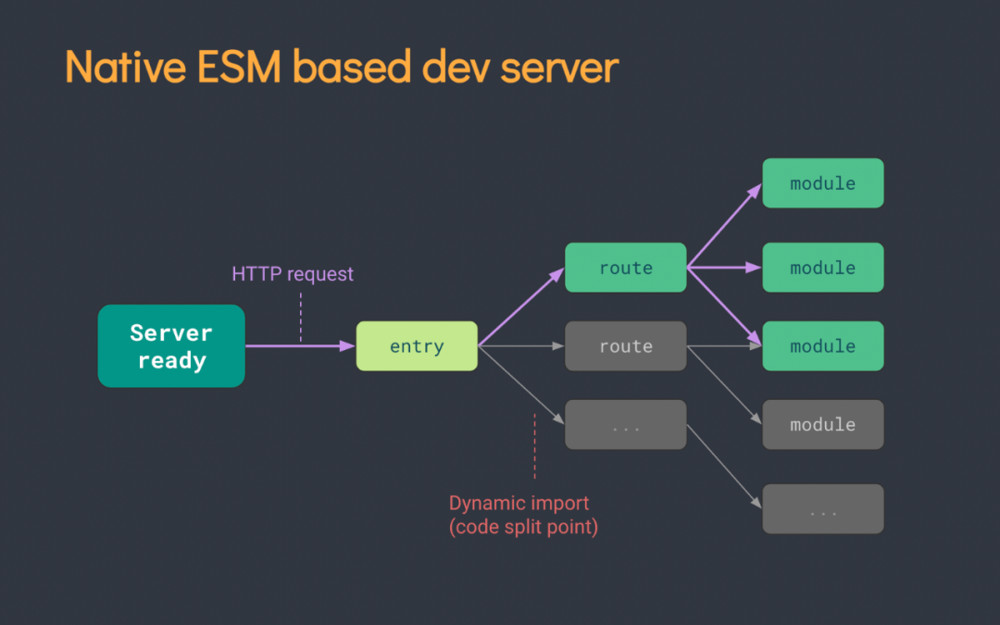

## webpack

根据配置初始化参数,加载插件,实例化webpack对象,调用run方法开始编译,识别所有入口文件,然后根据入口文件loader递归编译模块并构建依赖图谱,打包成chunk,输出到指定路径

多进程构建,代码压缩,缓存,exclude,include缩小搜索/构建范围


### 初始化

```
1. 安装webpack(先进入项目目录)
    全局安装
    npm install -g  webpack
    项目中安装
    npm install --save-dev webpack

    webpack --progress --config build/webpack.prod.js
    webpack --config webpack.config.js
    webpack --watch
    webpack serve --open

2. 快捷执行打包任务
    通过 npm init 初始化一个package.json文件
    在 package.json 文件中的 scripts 配置项中,添加一个脚本命令
3. 构建
   npm start
   npm run {script name}
```

### webpack优化

#### 构建时间优化
```
多进程打包 thread-loader:将thread-loader放在费资源loader前面

缓存cache-loader二次构建速度提升: 放在其他loaders前面,将缓存后面的loaders

快速定位位错误位置source-map: devtool中配置

热更新插件HotModuleReplacementPlugin

构建体积分析webpack-bundle-analyzer插件:可视化分析模块打包后的大小,gzip压缩后的大小,模块依赖关系
```

#### 打包体积优化
```
css压缩插件css-minimizer-webpack-plugin
js压缩插件terser-webpack-plugin
html压缩html-webpack-plugin
图片压缩image-webpack-loader
无用代码删除tree-sharking: webpack5生产模式默认开启,babel不能转译成es6一下的代码,要支持es6 module才有效
```

#### 用户体验优化
```
模块懒加载splitChunksPlugin:首屏请求所有资源,单页应用首屏加载慢,分块按需加载,提升首屏性能
gzip压缩插件 CompressionWebpackPlugin :后端还得设置,运输过程压缩,减少传输时间,客户端解析时间开销增加,Accept-Encoding:gzip来标识对压缩的支持
```

### 常见配置

> 入口文件生成initial(初始化) chunk, 包含入口起点指定的所有模块及其依赖项。
> non-initial 是可以延迟加载的块。可能会出现在使用 动态导入(dynamic imports) 或者 SplitChunksPlugin 时。

```
module.exports = (env) => {}

module.exports = {
  // 配置source-map
  devtool: dev: 'eval-source-map', "eval"
           pro: "source-map" "eval-cheap-module-source-map"
  // 入口
  entry: { // ['', '', '']  ''
    index: {
      filename: 指定输出output文件名
      import: './src/index.js', 启动时加载的模块
      runtime: '', // 同个入口不能与dependOn共存,运行时chunk名称
      dependOn: 'lodash' // 依赖的入口，在入口加载前先加载
    },
    lodash: 'lodash'
  },
  // 输出
  output: { // 常用占位符 文件hash:[contenthash] chunkId:[id] 入口文件名(默认main):[name]
    path: __dirname + "/public",
    pathinfo: false, // 不携带路径信息
    filename: "[name].bundle.js"
    chunkFilename: "[id].[contenthash].js"
  },
  mode:"produciton", // development
// 本地服务器
  devServer: {
    static: './dist',
    contentBase: "./public",//本地服务器所加载的页面所在的目录
    historyApiFallback: true,//不跳转
    hot: true, // 热更新
    port:"8080 "//监听端口
  },
// 模块切分
optimization:{
  usedExports: true, // tree shaking 生产模式默认开启
  runtimeChunk: 'single', // 定义共享运行时模块
  moduleIds: 'deterministic', // 文件hash变化小
  splitChunks:{
      cacheGroups: {
         vendor: {
           test: /[\\/]node_modules[\\/]/,
           name: 'vendors',
           chunks: 'all',
         }, // 开启缓存，内容不变打包生成相同的文件
      chunks: initial 表示入口文件中非动态引入的模块,动态和静态导入打包到不同chunk
              all 表示所有模块,动态导入和静态不超出包大小打包到同一个chunk
              async 表示异步引入的模块
      minSize:'', // 拆分包的大小, 至少为minSize
      maxSize:'', // 将大于maxSize的包，拆分为不小于minSize的包
      minChunks：n, // 静态被引入的次数超过n打包
      }
    }
  }
}
```

### loaders

webpack只能处理js,json文件,loaders处理特定类型文件,转换成相应模块,在bundle前打包相应模块

```
Loaders需要单独安装并且需要在webpack.config.js中的modules关键字下进行配置,Loaders的配置包括以下几方面:
加载时,数组从尾部开始执行
test:一个用以匹配loaders所处理文件的拓展名的正则表达式(必须)
use:[{loader,options}]
include/exclude:手动添加必须处理的文件(文件夹)或屏蔽不需要处理的文件(文件夹)(可选)
```

#### babel

> babel7下各个子库以 - 分割，7及之后 / 分割

`pnpm install -s -d @babel/core @babel/cli @babel/preset-env @babel/preset-react`

简单用法
```
// .babelrc
{
  "presets": [
    "@babel/preset-env"
  ]
}

// babel.config.js
module.exports = {
  presets: ['@babel/preset-env']
}

npx babel .\get-package.js --out-file dist/test-babel-output.js
```

`pnpm install --save-dev babel-core babel-loader babel-preset-env babel-preset-react`

```
module: {
    rules: [
        {
            test: /(\.jsx|\.js)$/,
            use: {
                loader: "babel-loader",
                options: {
                  presets: ['@babel/preset-env']
                }
            },
            exclude: /node_modules/
        }
    ]
}
```

#### postCSS

> 通过插件系统来转换 CSS 代码，自动添加浏览器前缀，适配不同浏览器，使用未正式纳入标准的css语法，与其他css预处理语言一样变量、混合等功能

`pnpm install --save-dev postcss postcss-cli autoprefixer`

简单用法
```
// postcss.config.js
module.exports = {
  plugins: [
    require('autoprefixer') // 自动添加浏览器前缀
  ]
};

npx postcss styles.css -o build/styles.css
```

`pnpm install --save-dev postcss-loader autoprefixer`

```
const path = require('path');
module: {
  rules: [
    {
      test: /\.css$/i,
      use: [
        {
          loader: 'css-loader', // 将 CSS 转换为 CommonJS 模块
          options: {
            importLoaders: 1, // 允许 css-loader 之前的 loaders 运行
          },
        },
        {
          loader: 'postcss-loader', // PostCSS 加载器
          options: { // 已定义 PostCSS 配置文件无需配置
            postcssOptions: {
              plugins: [
                // 自动添加浏览器前缀
                require('autoprefixer')({
                  overrideBrowserslist: ['> 1%', 'last 2 versions', 'not dead'],
                }),
                // 可以添加更多 PostCSS 插件...
              ],
            },
          },
        },
      ],
    },
  ],
}
```

### 插件(Plugins)

插件(Plugins)是用来拓展 Webpack 功能,在整个构建过程中生效,类似于谷歌插件

```
const webpack = require('webpack');
const ExtractTextPlugin = require('extract-text-webpack-plugin');
    plugins: [
        new webpack.HotModuleReplacementPlugin(),// 热加载插件
        new webpack.optimize.OccurrenceOrderPlugin(), // 分析和优先考虑使用最多的模块,并为它们分配最小的ID
    ],
```

`npm install --save-dev extract-text-webpack-plugin`

- - -

## vite

预构建依赖,等待 HTTP 请求,构建代码,vite 充分利用缓存加快重载

打包基于rollup,构建基于esbuild


### 初始化

安装

`$ npm init vite@latest`

`$ yarn create vite`

### 常用命令

```
vite
vite build
vite preview
vite optimize
```

### 官方提供插件

```
// vue
import vue from '@vitejs/plugin-vue'
export default {
  plugins: [vue()]
}


//vue jsx
import vueJsx from '@vitejs/plugin-vue-jsx'
export default {
  plugins: [
    vueJsx({
      // options are passed on to @vue/babel-plugin-jsx
    })
  ]
}

// 提供对 Vue 2.7 的单文件组件支持
import vue from '@vitejs/plugin-vue2'
export default {
  plugins: [vue()]
}

// 提供对 Vue 2.7 JSX 对支持
import vueJsx from '@vitejs/plugin-vue2-jsx'
export default {
  plugins: [
    vueJsx({
      // options are passed on to @vue/babel-preset-jsx
    })
  ]
}

// react-Babel
import { defineConfig } from 'vite'
import react from '@vitejs/plugin-react'
export default defineConfig({
  plugins: [react()]
})

// react-SWC
import { defineConfig } from "vite";
import react from "@vitejs/plugin-react-swc";
export default defineConfig({
  plugins: [react()],
});

//babel
import legacy from '@vitejs/plugin-legacy'
export default {
  plugins: [
    legacy({
      targets: ['defaults', 'not IE 11']
    })
  ]
}
```

## gulp

```
const { src, dest, series, parallel, task } = require('gulp');
const uglify = require('gulp-uglify'); // 用于压缩JS
const sass = require('gulp-sass')(require('sass')); // 用于编译Sass
const cleanCSS = require('gulp-clean-css'); // 用于压缩CSS
const autoprefixer = require('gulp-autoprefixer'); // 添加CSS前缀

task('pack:clean', () => {
  return src(distPath, {allowEmpty: true}).pipe(gulpClean({force: true}))
})

function minifyScripts() {
  return src('src/js/**/*.js') // 获取源文件
    .pipe(uglify()) // 压缩JS
    .pipe(dest('dist/js')); // 输出到目标目录
}

function compileSass() {
  return src('src/scss/**/*.scss') // 获取Sass源文件
    .pipe(sass().on('error', sass.logError)) // 编译Sass
    .pipe(autoprefixer()) // 添加浏览器前缀
}

// 可以定义更多的任务，例如监听文件变化重新构建
function watchFiles() {
  gulp.watch('src/js/**/*.js', minifyScripts);
  gulp.watch('src/scss/**/*.scss', compileSass);
}

series.pipe(dest('dist/css')); // 输出到目标目录

// 定义默认任务（当运行`gulp`时不加任何参数时执行）
exports.default = series(parallel(minifyScripts, compileSass)); // 并行parallel或串行series执行多个任务

// 如果需要在监视模式下运行，则可以添加一个watch任务
exports.watch = series(exports.default, watchFiles);
```

### 常用命令

```
gulp 执行默认任务
gulp pack:clean 或者单独执行某个任务
gulp watch 若要开启文件监听模式
```
